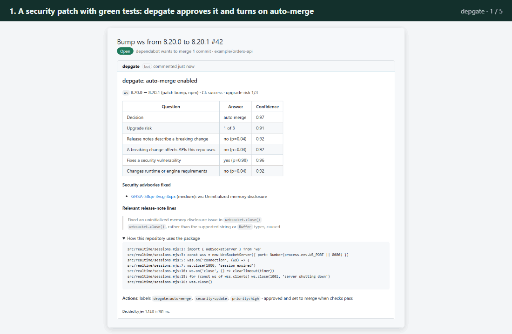
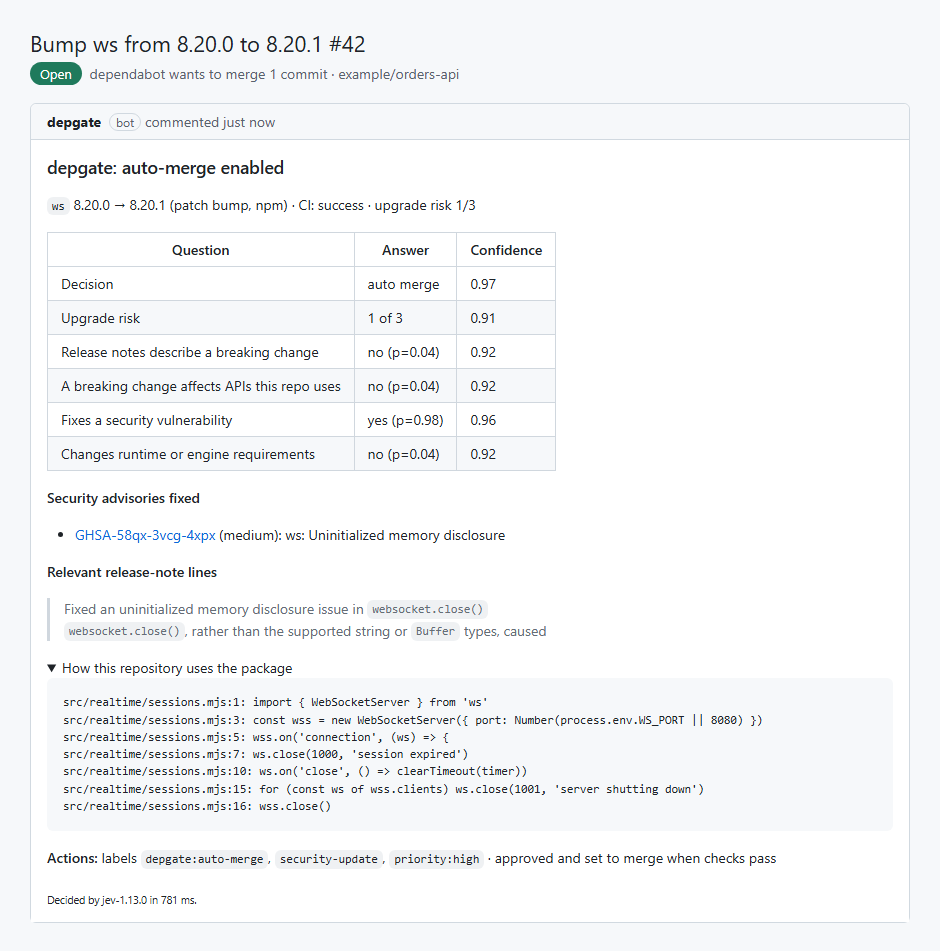
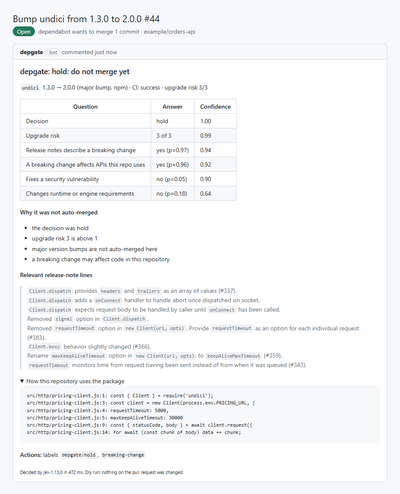
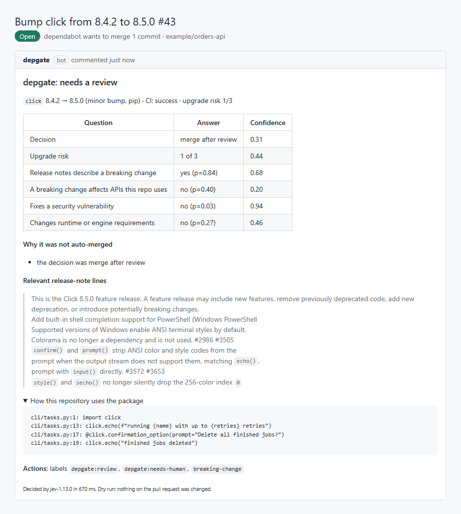
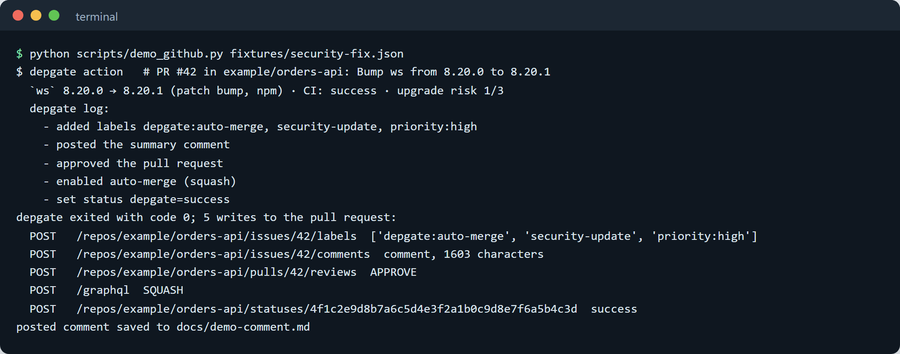
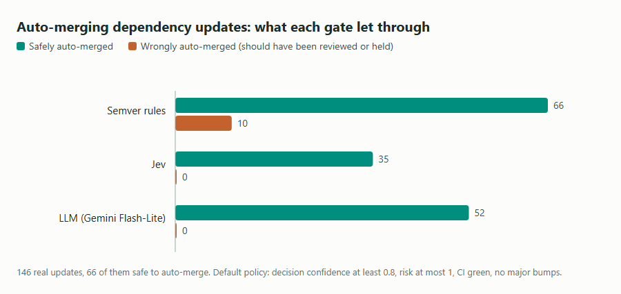
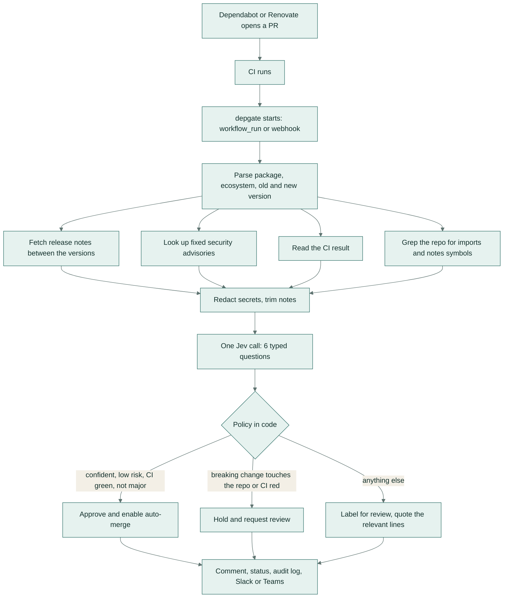
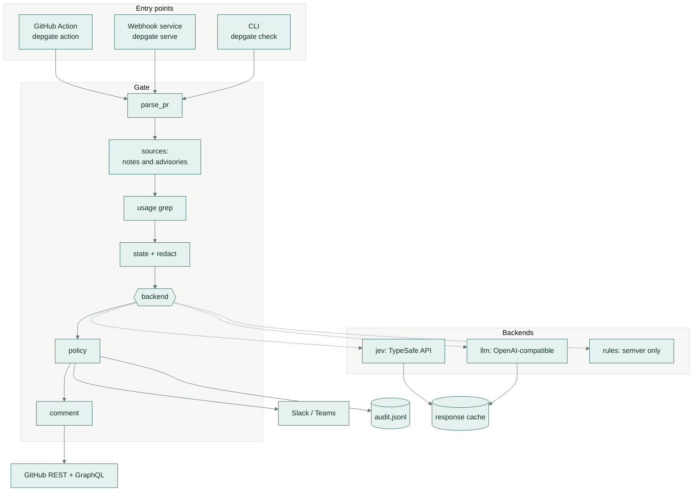
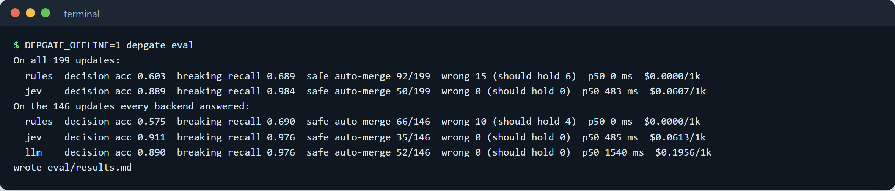

# depgate

**An auto-merge gate for Dependabot and Renovate pull requests.** It reads the release notes, checks how your code
uses the package, and decides: merge it now, have a person look, or hold it. Built on Jev, TypeSafe AI's typed
decision model.



*Three real updates go through depgate: a security patch it merges by itself, a release with a breaking change your
code doesn't touch (sent for a quick review), and a release that removes options your code still uses (held).*

## What it does

Bots open a pull request every time one of your libraries releases a new version. Most are safe to merge, a few
will break your app, and someone has to read every changelog to tell which is which. depgate does that reading for
you: it merges the safe ones, holds the dangerous ones and, for the rest, tells the reviewer exactly which lines
of the release notes matter.

## A real-life example

Maya leads the platform team at Kettlewick, a 14-developer company that sells booking software to gyms. Their
four repositories get about 40 dependency pull requests a week. Before depgate, Maya spent most of Monday morning
opening changelogs: roughly 4 hours a week, and a "minor" update still broke checkout twice last year because
nobody noticed a renamed option.

With depgate, low-risk patches with green tests merge themselves, security fixes arrive labelled as priority, and
every other pull request opens with a comment that quotes the three or four release-note lines that matter and the
places in Kettlewick's code that use the package. Maya now spends about an hour a week on updates, and the update that
renamed `requestTimeout` was held automatically, with the exact line of code it would have broken.

## How you would use it

1. Ask your developers to add the depgate workflow file to a repository (it is about 20 lines, shown below) and
   save your TypeSafe AI key as a secret.
2. Keep using Dependabot or Renovate as you do now. Nothing changes in how update pull requests are opened.
3. After the tests run on each update, depgate posts one comment on the pull request: auto-merge, review or hold,
   with the reasons.
4. Safe updates merge themselves once your required checks pass. You only open the ones labelled
   `depgate:review` or `depgate:hold`.
5. Optionally, get a Slack or Teams message whenever an update is held or fixes a security problem.

## Screenshots

| | |
|---|---|
|  |  |
| **Merged by itself.** A patch to the `ws` WebSocket library fixes a security advisory, CI is green and nothing breaks, so depgate labels it as a priority security update, approves it and turns on auto-merge. | **Held.** `undici` 2.0 removes the `requestTimeout` option and renames `maxKeepAliveTimeout`. The repository uses both (bottom box), so depgate holds the update and quotes the release-note lines that explain why. |
|  |  |
| **Sent for review.** `click` 8.5 has breaking changes, and Jev is unsure whether this code is affected (confidence 0.20), so it gets `depgate:review` plus `depgate:needs-human`, and the release-note lines to read. | **The Action at work.** The same code path the GitHub Action runs, against a local stand-in for the GitHub API: it labels the pull request, comments, approves and enables auto-merge. |



*On the 146 real updates all three gates answered, the common "auto-merge every patch and minor update" rule merged
10 updates that should have waited for a person (4 of them should have been held). depgate with Jev, and with an LLM,
merged none of those.*

## Results in one table

All numbers come from recorded real API calls on a labelled set of 199 real npm and PyPI updates (full report:
[eval/results.md](eval/results.md); how they were labelled: [eval/LABELLING.md](eval/LABELLING.md)).

The LLM backend (Gemini Flash-Lite) was measured on 146 of the 199 updates (its free-tier daily quota), so the
three-way comparison uses those 146; the full 199 follow below it.

| On the 146 updates all three answered | Semver rules | Jev | LLM (Gemini Flash-Lite) |
|---|---|---|---|
| Updates safely auto-merged | 66 (45%) | 35 (24%) | 52 (36%) |
| **Wrongly auto-merged** (should have been reviewed or held) | **10** (4 should have been held) | **0** | **0** |
| Breaking changes in the notes found (recall) | 69% | 98% | 98% |
| Decision accuracy (auto-merge / review / hold) | 57.5% | 91.1% | 89.0% |
| Calibration, Brier score of the decision (lower is better) | 0.425 | 0.082 | 0.096 |
| Time per update, typical / slowest 5% | none | 0.49 s / 0.69 s | 1.54 s / 15.5 s |
| Cost per 1,000 updates | $0 | $0.061 | $0.196 |

On all 199 updates: the semver rules auto-merged 92 safe updates and 15 wrong ones (6 that should have been held);
depgate with Jev auto-merged 50 safe updates and no wrong ones, with 88.9% decision accuracy and 98.4%
breaking-change recall.

What the numbers mean: the semver rule merges every patch and minor update, including the ones whose notes say
something your code uses was removed. Jev and the LLM both kept wrong merges at zero at the default threshold. The LLM
states higher confidence, so it clears the 0.8 bar more often, but its stated confidence is less honest: when it
says 0.8 to 0.9 it is right 67% of the time, and at thresholds of 0.7 or lower it starts merging updates that needed
a review. Jev stays at zero wrong merges at every threshold from 0.5 to 0.95 (48 safe merges at 0.5), and answers
three times faster at a third of the cost.

"Semver rules" is the baseline most teams use today: auto-merge patch and minor bumps when CI is green, hold majors.

## Rolling it out to a team

A safe rollout takes about two weeks and needs no change to how developers work.

1. **Week 1: watch only.** Add the workflow with `dry-run: "true"`. depgate writes its decision to the job log
   and changes nothing. Compare its calls with what your reviewers decided.
2. **Turn on labels and comments.** Set `dry_run: false` and `auto_merge.enabled: false` in
   `.github/depgate.yml`. Every update now gets a comment and a label, and people still merge by hand.
3. **Turn on auto-merge for one repository.** Set `auto_merge.enabled: true`. Keep `min_confidence: 0.8` and
   `allow_major: false`. Branch protection still applies: auto-merge waits for your required checks.
4. **Add the guard rails you want.** List packages that always need a person in `auto_merge.ignore` (your
   framework, your database driver). Set `fail_check_on_hold: true` and make the `depgate` status required if held
   updates must never be merged by accident.
5. **Wire up notifications and the audit log.** Point `DEPGATE_SLACK_WEBHOOK` or `DEPGATE_TEAMS_WEBHOOK` at your
   platform channel. Ship `.depgate/audit.jsonl` (or the container's `/data/audit.jsonl`) to your log store to review
   every decision later.
6. **Roll out to more repositories,** or run one self-hosted container for the whole organisation (below).

Who owns what: the platform team owns the policy file and the key; reviewers only see labels and comments; security
gets `security-update` labels and, optionally, review requests through `security_reviewers`.

---

## How it works

For every update pull request depgate gathers five inputs, asks Jev six typed questions in a single call, and lets a
small policy written in code decide what to do.



Step by step:

1. **Trigger.** In GitHub Actions, depgate runs after your CI workflow finishes on a bot branch (`workflow_run`), so
   the CI result is known. The self-hosted service gets the same events by webhook.
2. **Parse the pull request.** Dependabot titles (`Bump axios from 1.6.0 to 1.7.2`), Renovate titles and their
   version tables, and GitHub Actions bumps are recognised. Grouped updates are skipped and left to people.
3. **Release notes.** The package's source repository comes from the npm registry or PyPI; the GitHub releases
   between the two versions are joined. Long notes are trimmed to about 5,000 characters, keeping every line that
   mentions breaking changes, removals, defaults, security or runtime versions.
4. **Advisories.** The GitHub Advisory Database lists advisories that affect the old version and not the new one.
5. **Usage.** A grep over the checkout finds the files that import the package, the lines that use symbols named in
   the release notes, the package's own config files (`jest.config.js`, `tox.ini`), and declared runtimes
   (`engines`, `requires-python`). At most 25 `file:line: code` lines are sent, never whole files.
6. **One Jev call** answers six questions with probabilities (next section).
7. **Policy.** Plain Python decides: auto-merge only when every condition holds; otherwise review or hold, with a
   list of reasons. Low confidence on any routing answer adds `depgate:needs-human`.
8. **Act and record.** Labels, one summary comment (updated in place on every run), review requests, approval and
   auto-merge, a `depgate` commit status, a chat notification for holds and security fixes, and one JSONL audit line.

### The Jev call

Jev is not a chat model: it takes a "state" and named, typed questions and returns typed answers with
probabilities, in one call of about half a second. depgate asks:

| Question | Type | Answer |
|---|---|---|
| `decision` | Choice | `auto_merge`, `merge_after_review` or `hold`, with a probability for each |
| `risk` | Score | upgrade risk on a 0 to 3 rubric |
| `breaking_in_notes` | Noul | probability that the release notes describe a breaking change |
| `breaking_affects_repo` | Noul | probability that a breaking change affects APIs this repo uses |
| `security_fix` | Noul | probability that the update fixes a security vulnerability |
| `runtime_change` | Noul | probability that Node, Python or engine requirements change |

The "Choice" confidence is how far the top option sits above an even split; the Score confidence also weighs how
far the other probabilities sit from the chosen level. The policy uses the decision confidence for auto-merge
(default 0.8) and the confidence of `decision`, `risk` and `breaking_affects_repo` for the needs-human flag
(default 0.5).

### Architecture



All three backends implement one interface (`decide(update) -> Decision`), so the policy, comment and evaluation
treat them the same. Responses are cached on disk by request hash; the evaluation and CI replay the cache and never
call a live API.

## Setup and usage

### As a GitHub Action

Add `.github/workflows/depgate.yml` to a repository (also in [examples/depgate-workflow.yml](examples/depgate-workflow.yml)):

```yaml
name: depgate
on:
  workflow_run:
    workflows: ["CI"]          # the name of your test workflow
    types: [completed]
permissions:
  contents: write
  pull-requests: write
  statuses: write
  checks: read
jobs:
  gate:
    if: >-
      github.event.workflow_run.event == 'pull_request' &&
      contains(fromJSON('["dependabot[bot]", "renovate[bot]"]'), github.event.workflow_run.actor.login)
    runs-on: ubuntu-latest
    steps:
      - uses: actions/checkout@v4
      - uses: samiulhuda360/depgate@v1
        with:
          typesafe-api-key: ${{ secrets.TYPESAFE_API_KEY }}
```

Then, in the repository settings: turn on **Allow auto-merge**, and (to let depgate approve) **Allow GitHub
Actions to create and approve pull requests**. Action inputs: `typesafe-api-key`, `github-token` (defaults to the
job token), `config` (default `.github/depgate.yml`), `dry-run`, `backend`. Outputs: `action` and `risk`.

### Policy file

`.github/depgate.yml`, every key optional (full list with defaults in [examples/depgate.yml](examples/depgate.yml)):

```yaml
auto_merge:
  min_confidence: 0.8      # Jev's decision confidence needed to merge without a person
  max_risk: 1              # upgrade risk 0-3
  allow_major: false
  require_ci: true
  merge_method: SQUASH
  ignore: [typescript]     # always needs a person
reviewers: ["@your-org/platform"]
security_reviewers: ["@your-org/security"]
fail_check_on_hold: false
notify:
  events: [hold, security]
```

### As a self-hosted webhook service

One container can serve every repository in an organisation. It reads each repository's `.github/depgate.yml`
through the API, and uses code search instead of a checkout to find usage.

```bash
docker build -t depgate .
docker run -d -p 8080:8080 -v depgate-data:/data \
  -e DEPGATE_WEBHOOK_SECRET -e GITHUB_TOKEN -e TYPESAFE_API_KEY depgate
```

Point a GitHub App or organisation webhook at `https://<host>/webhook` with the same secret, sending
**Pull requests** and **Check suites** events. `GET /healthz` answers `{"ok": true}`. Decisions are written to
`/data/audit.jsonl`.

### Locally, from the command line

```bash
python -m venv .venv && . .venv/bin/activate      # Windows: .venv\Scripts\activate
pip install -e ".[dev]"

# Judge a recorded update (no key needed: replays the cached Jev answer)
DEPGATE_OFFLINE=1 depgate check fixtures/breaking-hold.json --backend jev --cache eval/cache

# Fetch real release notes and advisories for an update and judge it live
TYPESAFE_API_KEY=... depgate check my-update.json --fetch --repo-dir .

# The Action's full code path against a local stand-in for the GitHub API
python scripts/demo_github.py fixtures/security-fix.json

# Re-run the evaluation from the recorded responses
DEPGATE_OFFLINE=1 depgate eval
```

### Configuration (environment variables)

| Variable | Used for |
|---|---|
| `TYPESAFE_API_KEY` | the Jev backend (without it, `backend: auto` uses the semver rules) |
| `GITHUB_TOKEN` | reading the pull request and acting on it |
| `AI_API_KEY`, `AI_BASE_URL`, `AI_MODEL`, `AI_MIN_INTERVAL` | the optional `llm` backend (any OpenAI-compatible endpoint) |
| `DEPGATE_WEBHOOK_SECRET` | the webhook service (required there) |
| `DEPGATE_SLACK_WEBHOOK`, `DEPGATE_TEAMS_WEBHOOK` | chat notifications (names can be changed in the policy) |
| `DEPGATE_BACKEND`, `DEPGATE_DRY_RUN`, `DEPGATE_CONFIG` | overrides set by the Action inputs |
| `DEPGATE_AUDIT_LOG`, `DEPGATE_CACHE_DIR` | where the service writes its audit log and cache |
| `DEPGATE_OFFLINE` | `1` replays cached responses only and never calls an API (CI) |

## Evaluation

**Data.** 199 real version bumps of 50 popular packages (116 npm, 83 PyPI; 69 major, 59 minor, 71 patch; 44 fix a
security advisory), with their public GitHub release notes. The source of each is listed in
[eval/data/SOURCES.md](eval/data/SOURCES.md). Each update is paired with one or two short, invented source files
that use the package; for about half of the updates with breaking changes, those files use exactly what breaks.
CI results are simulated (80% green, 12% red, 8% running). Every update was labelled by the written rules in
[eval/LABELLING.md](eval/LABELLING.md): 92 auto-merge, 62 review, 45 hold.

**What is measured** (`depgate eval`, report in [eval/results.md](eval/results.md)):

- the full policy: updates safely auto-merged, and updates wrongly auto-merged (gold answer review or hold);
- breaking-change recall, and how many held updates the raw answer catches;
- per-question accuracy and F1, decision macro-F1, risk accuracy;
- calibration: Brier score and a reliability table;
- latency (p50, p95) and cost per 1,000 pull requests from real token counts;
- automation at confidence thresholds from 0.5 to 0.95.

Automation at different confidence thresholds (same policy, on the 146 updates all three answered):

| Minimum decision confidence | Jev: safe / wrong | LLM: safe / wrong | Semver rules: safe / wrong |
|---|---|---|---|
| 0.50 | 48 / 0 | 62 / 2 | 66 / 10 |
| 0.70 | 44 / 0 | 62 / 2 | 66 / 10 |
| 0.80 (default) | 35 / 0 | 52 / 0 | 66 / 10 |
| 0.90 | 26 / 0 | 43 / 0 | 66 / 10 |
| 0.95 | 16 / 0 | 25 / 0 | 66 / 10 |

Per question on the full 199 updates, Jev: decision accuracy 88.9% (macro-F1 0.884), risk level exact 88.9% (mean
error 0.12 levels), `breaking_in_notes` F1 0.889, `breaking_affects_repo` F1 0.703, `security_fix` F1 0.989,
`runtime_change` F1 0.706. The four yes/no answers pooled have a Brier score of 0.052. Per-question tables for all
three backends, confusion matrices and reliability tables are in [eval/results.md](eval/results.md).



*`depgate eval` replays the recorded answers and prints the headline numbers for each backend.*

**Spend.** The evaluation and demos used 234 Jev calls (about 370,000 input tokens and 29,000 output tokens, about $0.015 in total) and 152 successful Gemini calls on the free tier (about 217,000 input and 22,000 output tokens).

## Tests and CI

```bash
ruff check . && ruff format --check . && mypy . && pytest
```

48 tests cover version parsing and advisory ranges, Dependabot/Renovate/Actions title parsing, the usage
grep, secret redaction, the Jev and LLM backends (with fake transports, cache replay and offline mode), the policy
and every auto-merge blocker, the comment, the GitHub client against a fake API (labels, comment upsert, approval,
GraphQL auto-merge, status, CI state), webhook signatures, metrics, and an offline replay of the whole evaluation.
The CI workflow runs the same commands, replays the evaluation and fails if `eval/results.md` changes, and runs
every fixture. CI never calls a model.

## Project structure

```
depgate/
  cli.py            check, action, serve, eval
  gate.py           one run: gather inputs, decide, act, notify, audit
  parse_pr.py       Dependabot / Renovate / Actions titles and tables
  sources.py        registry lookups, GitHub releases, advisories (cached)
  usage.py          grep for imports, notes symbols, config files and runtimes
  state.py          the state sent to a backend; release-notes digest
  redact.py         secret redaction
  questions.py      the six typed questions
  backends/         jev.py, llm.py, rules.py, base.py (interface, confidence formulas)
  config.py         reads .github/depgate.yml
  policy.py         auto-merge rules and blockers
  comment.py        the summary comment with quoted release-note lines
  github.py         REST + GraphQL client
  server.py         webhook service
  notify.py         Slack / Teams
  audit.py          JSONL audit log
  evaluate.py       the evaluation and results.md
  metrics.py        accuracy, F1, Brier, reliability
eval/
  data/             updates.jsonl, labels.jsonl, SOURCES.md
  cache/            recorded Jev and LLM responses (replayed offline)
  LABELLING.md      the labelling guide
  results.md        the latest evaluation
examples/           workflow and policy file to copy
fixtures/           four real updates for the CLI and the demo
scripts/            build_dataset.py, demo_github.py, make_chart.py
action.yml          the composite GitHub Action
Dockerfile          the webhook service image
SECURITY.md         permissions, data handling, reporting
```

## Tech stack

Python 3.11+, httpx, PyYAML, the standard-library HTTP server; Jev (TypeSafe AI System One API) for decisions;
GitHub REST and GraphQL APIs; npm registry, PyPI JSON API and the GitHub Advisory Database for public data; pytest,
ruff and mypy; GitHub Actions (composite action) and Docker.

## Security and data handling

Only package names, versions, public release notes and advisories, the CI result and up to 25 redacted usage lines
are sent to the decision API: never source files, diffs or secrets. Details, permissions and reporting:
[SECURITY.md](SECURITY.md).

depgate is an independent project and is not affiliated with TypeSafe AI.

## Licence

MIT, see [LICENSE](LICENSE). Release notes quoted in `eval/data/` belong to their projects and are used under
their licences (MIT, BSD-3-Clause, Apache-2.0 and ISC), listed in [eval/data/SOURCES.md](eval/data/SOURCES.md).
